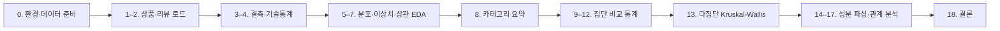

# Sephora EDA·통계·시각화 답안 노트북 소스 설명

## 1. 문서 목적

본 문서는 실습 답안 노트북 `Sephora_EDA_통계_시각화_답안.ipynb`의 **코드가 무엇을 하는지**, **왜 그렇게 작성했는지**, **사용된 통계·알고리즘 용어가 무엇을 의미하는지**를 단계별로 설명합니다.

- **대상 독자**: Python·Pandas 기초는 알지만, EDA·가설검정·성분 파싱이 처음인 학습자
- **어려운 용어**: **§2.5「쉽게 읽기」표**와 본문 **「쉽게 말하면」** 인용 블록을 먼저 보면 Kruskal-Wallis, Mann–Whitney, p-value 등을 빠르게 이해할 수 있습니다.
- **연관 파일**
  - 과제: `Sephora 화장품 가격·평점·성분 EDA 실습 과제.txt`
  - 답안: `Sephora_EDA_통계_시각화_답안.ipynb`
  - 데이터: `Sephora Products and Skincare Reviews/` (또는 동명 zip 압축 해제)

---

## 2. 전체 분석 흐름



| 단계 | 과제 조건 | 핵심 산출물 |
|------|-----------|-------------|
| 0 | (준비) | 압축 해제, 경로, 라이브러리 |
| 1–2 | 1, 2 | `products`, `reviews` DataFrame |
| 3–4 | 3, 4 | 결측표, `describe()` |
| 5–7 | 5, 6, 7 | 히스토그램, 박스플롯, 상관 히트맵 |
| 8 | 8 | `primary_category`별 요약표 |
| 9–12 | 9–12 | exclusive 집단 비교, 검정 결과 |
| 13 | 13 | 카테고리별 Kruskal-Wallis |
| 14–17 | 14–17 | `ingredient_count`, 성분 TOP10, 요약 scatter |
| 18 | 18 | 수치 요약 + 3문장 결론 |

---

## 2.5 통계·분석 용어 — 쉽게 읽기

아래는 본문에 나오는 **어려운 이름**을 먼저 풀어 쓴 요약입니다. 각 단계 설명에도 같은 형식의 **「쉽게 말하면」** 박스를 붙였습니다.

| 용어 | 쉽게 말하면 |
|------|-------------|
| **EDA** | 분석 전에 데이터를 **표·그림으로 훑어보는** 단계 (“데이터가 어떤 모양인지 감 잡기”) |
| **결측** | **비어 있는 칸** (가격·성분 등이 기록되지 않음) |
| **기술통계** | 평균·중앙값처럼 데이터를 **한 줄로 요약**한 숫자 |
| **히스토그램** | 값을 구간별로 **몇 개씩 있는지** 막대로 보여 주는 그림 |
| **박스플롯** | 중앙값·퍼짐·튀는 값을 **상자 그림**으로 보는 것 |
| **IQR / 이상치** | “보통 범위”를 벗어난 **튀는 값** (꼭 잘못된 데이터는 아님) |
| **상관계수** | 두 숫자가 **함께 커지거나 작아지는 경향** (원인·결과는 아님) |
| **실험군·대조군** | **비교할 두 무리** (여기서는 Sephora 단독 vs 그 외) |
| **정규분포** | **종 모양**으로 고르게 퍼진 분포 (가격·리뷰 수는 종 모양이 아닌 경우가 많음) |
| **가설검정** | “차이가 **우연**인가, **진짜**인가?”를 숫자로 판단하는 절차 |
| **p-value** | “우연히 이런 차이가 날 **확률**” — **0.05 미만**이면 보통 “차이 있다”고 말함 |
| **t검정** | **두 그룹의 평균**이 다른지 보는 검정 (데이터가 종 모양에 가깝다고 가정) |
| **Mann–Whitney U** | **두 그룹**을 **순위(등수)** 로 비교 — 종 모양이 아니어도 사용 가능 |
| **Kruskal–Wallis** | **세 그룹 이상**(카테고리 여러 개)을 **순위**로 한꺼번에 비교 — “어딘가는 다르다”만 알려 줌 |
| **ANOVA** | **세 그룹 이상**의 **평균** 차이 검정 (종 모양·분산 가정 필요) |
| **효과크기** | p-value와 별개로 “차이가 **실생활에서 얼마나 큰지**” |
| **Cohen's d** | t검정 쪽 **효과크기** (0.2 작음, 0.5 중간, 0.8 큼 — 경험적 기준) |
| **사후검정** | “전체는 다르다”고 나온 뒤 **어느 쌍이 다른지** 짝지어 보는 추가 검정 |

---

## 3. 데이터셋 개요

### 3.1 상품 정보 (`product_info.csv`) — 요약

한 **행(row)** = Sephora에 등록된 **한 상품(또는 변형)**.

실행 예시 기준 대략 **8,494행 × 27열**.

| 핵심 컬럼 | 의미 | 분석에서의 역할 |
|-----------|------|-----------------|
| `product_id` | 상품 고유 ID | 집계·조인 키 |
| `product_name`, `brand_name` | 이름·브랜드 | 탐색용 |
| `price_usd` | 가격(USD) | 연속형(수치형) 변수 |
| `rating` | 평균 평점 | 연속형; 일부 결측 |
| `reviews` | 리뷰 개수 | 인기·노출 지표 |
| `loves_count` | “좋아요” 수 | 참여 지표 |
| `ingredients` | 성분 문자열(리스트 형태 텍스트) | 14단계 이후 파싱 |
| `primary_category` | 대분류(스킨케어, 메이크업 등) | 그룹 요약·Kruskal-Wallis |
| `sephora_exclusive` | 0/1, Sephora 단독 여부 | **비교 집단 vs 기준 집단** |

> **쉽게 말하면:** “Sephora 사이트에 올라온 **상품 카드 한 장**을 한 줄로 적어 둔 표”입니다. 가격·별점·성분·카테고리·단독 판매 여부 등이 들어 있습니다.

### 3.2 리뷰 (`reviews_*.csv` 5개) — 요약

파일이 용량 때문에 **5개로 분할**되어 있습니다. 각 행은 **한 사용자의 한 리뷰**입니다.

| 컬럼 예 | 의미 |
|---------|------|
| `author_id` | 작성자 |
| `rating` | 리뷰별 별점 |
| `review_text`, `review_title` | 본문·제목 |
| `product_id` | 어떤 상품에 대한 리뷰인지 |
| `skin_type`, `skin_tone` 등 | 사용자 프로필 |

병합 후 약 **109만 행** 수준입니다.  
**본 답안의 통계 검정·상관 분석은 주로 `products`(상품 단위)** 를 사용하고, 리뷰는 **로드·결측 확인(과제 2–3)** 에 맞춰 두었습니다. (상품 단위 집계와 리뷰 단위 raw 데이터는 분석 단위가 다릅니다.)

---

### 3.3 피처(컬럼) 상세 설명 — `product_info.csv`

아래는 상품 파일 **27개 피처**를 역할별로 풀어 쓴 설명입니다.  
(수치·결측 개수는 실습 데이터 기준이며, 데이터가 바뀌면 조금 달라질 수 있습니다.)

#### (1) 식별·이름 정보

| 피처 | 타입 | 결측(대략) | 고유값 | 설명 | 쉽게 말하면 |
|------|------|------------|--------|------|-------------|
| `product_id` | 문자열 | 0 | 8,494 | Sephora 상품 고유 코드 (예: `P473671`) | **상품 번호표** |
| `product_name` | 문자열 | 0 | ≈8,415 | 상품명 | **포장에 적힌 이름** |
| `brand_id` | 정수 | 0 | 304 | 브랜드 숫자 ID | 브랜드용 **내부 번호** |
| `brand_name` | 문자열 | 0 | 304 | 브랜드명 (예: `19-69`, `NUDESTIX`) | **브랜드 이름** |

- `product_id`는 상품마다 하나씩이라 **중복 없이** 조인·집계 키로 씁니다.
- `brand_id`와 `brand_name`은 **1:1**에 가깝게 대응합니다 (304개 브랜드).

#### (2) 인기·평가 지표 (본 실습의 핵심 수치)

| 피처 | 타입 | 결측(대략) | 설명 | 쉽게 말하면 | 실습에서의 쓰임 |
|------|------|------------|------|-------------|-----------------|
| `loves_count` | 정수 | 0 | 사용자가 “Love”(하트)를 누른 횟수 | **찜/좋아요 수** | 기술통계·상관 |
| `rating` | 실수 | ≈278 | 상품 **평균 별점** (보통 1~5점 스케일) | **평균 평점** | 분포·집단비교·성분 관계 |
| `reviews` | 실수 | ≈278 | 해당 상품에 달린 **리뷰 개수** | **리뷰가 몇 개인지** | 분포·상관 |

- `rating`과 `reviews` 결측이 **같은 행**에서 함께 나타나는 경우가 많습니다 (아직 평가가 없는 상품).
- 리뷰 파일의 `rating`은 **한 사람이 준 별점**, 상품 파일의 `rating`은 **여러 리뷰의 평균**이라 단위가 다릅니다.

#### (3) 가격 관련

| 피처 | 타입 | 결측(대략) | 설명 | 쉽게 말하면 | 실습에서의 쓰임 |
|------|------|------------|------|-------------|-----------------|
| `price_usd` | 실수 | 0 | 현재 표시 가격(USD) | **지금 파는 가격** | **핵심 종속/비교 변수** |
| `value_price_usd` | 실수 | ≈8,043 | “정가/가치 가격” 표시 (세트·할인 맥락) | **원래 가치로 적힌 가격** | 본 실습에서는 거의 미사용 |
| `sale_price_usd` | 실수 | ≈8,224 | 세일 가격 | **할인된 가격** | 본 실습에서는 거의 미사용 |
| `child_max_price` | 실수 | ≈5,740 | 하위 변형(용량·색상 등) 중 **최고가** | **옵션 중 제일 비싼 것** | 보조 정보 |
| `child_min_price` | 실수 | ≈5,740 | 하위 변형 중 **최저가** | **옵션 중 제일 싼 것** | 보조 정보 |
| `child_count` | 정수 | 0 | 하위 변형(자식 상품) 개수 | **옵션이 몇 개인지** | 보조 정보 |

> **쉽게 말하면:** 실습에서 말하는 “가격”은 거의 항상 **`price_usd`** 입니다. `value_price_usd` / `sale_price_usd`는 결측이 많아 보조 컬럼으로 두는 편이 안전합니다.

#### (4) 용량·변형(옵션) 정보

| 피처 | 타입 | 결측(대략) | 고유값(대략) | 설명 | 쉽게 말하면 |
|------|------|------------|--------------|------|-------------|
| `size` | 문자열 | ≈1,631 | ≈2,055 | 용량/크기 표기 (예: `3.4 oz/ 100 mL`) | **몇 ml인지** |
| `variation_type` | 문자열 | ≈1,444 | 7 | 변형 종류 라벨 (Size, Color 등) | **어떤 종류의 옵션인지** |
| `variation_value` | 문자열 | ≈1,598 | ≈2,729 | 변형 값 (예: `3.4 oz/ 100 mL`) | **옵션의 실제 값** |
| `variation_desc` | 문자열 | ≈7,244 | ≈935 | 변형 부가 설명 (색 이름 등) | **옵션 설명 문구** |

#### (5) 성분·하이라이트 (텍스트형 피처)

| 피처 | 타입 | 결측(대략) | 설명 | 쉽게 말하면 | 실습에서의 쓰임 |
|------|------|------------|------|-------------|-----------------|
| `ingredients` | 문자열 | ≈945 | Python 리스트처럼 보이는 **성분 목록 텍스트** | **들어간 재료 목록** | 14~17단계 파싱·개수·TOP10 |
| `highlights` | 문자열 | ≈2,207 | 마케팅 키워드 리스트 문자열 (예: `Fresh Scent`) | **상품 강조 태그** | 본 실습에서는 미사용 |

`ingredients` 예시 형태:

```text
['Capri Eau de Parfum:', 'Alcohol Denat. (SD Alcohol 39C), Parfum (Fragrance), ...']
```

- 세트 상품은 **제품명 + 콜론 + 성분**이 여러 덩어리로 들어 있을 수 있습니다.
- 답안 노트북의 `parse_ingredients()`가 이 문자열을 잘라 **성분 개수**를 만듭니다.

#### (6) 0/1 플래그 (이진 피처)

값이 **0=아니오, 1=예**인 숫자입니다.

| 피처 | 1의 개수(대략) | 설명 | 쉽게 말하면 | 실습에서의 쓰임 |
|------|----------------|------|-------------|-----------------|
| `limited_edition` | ≈597 | 리미티드 에디션 여부 | **한정판인가?** | 상관 행렬에 포함 |
| `new` | ≈609 | 신상품 여부 | **새로 나왔나?** | 상관 행렬에 포함 |
| `online_only` | ≈1,861 | 온라인 전용 여부 | **매장엔 없고 온라인만?** | 상관 행렬에 포함 |
| `out_of_stock` | ≈626 | 품절 여부 | **지금 살 수 없나?** | 상관 행렬에 포함 |
| `sephora_exclusive` | ≈2,373 | Sephora 단독 판매 여부 | **세포라에서만 파나?** | **실험군(1) vs 대조군(0)** |

> **쉽게 말하면:** `sephora_exclusive=1`인 상품 ≈2,373개, `0`인 상품 ≈6,121개입니다. 9~12단계 집단 비교의 **핵심 피처**입니다.

#### (7) 카테고리 (계층 구조)

| 피처 | 타입 | 결측(대략) | 고유값 | 설명 | 쉽게 말하면 |
|------|------|------------|--------|------|-------------|
| `primary_category` | 문자열 | 0 | 9 | 대분류 | **큰 진열장** |
| `secondary_category` | 문자열 | ≈8 | ≈41 | 중분류 | **그 안의 구역** |
| `tertiary_category` | 문자열 | ≈990 | ≈118 | 소분류 | **더 세부 칸** |

`primary_category` 분포(실습 데이터 기준):

| primary_category | 상품 수(대략) |
|------------------|---------------|
| Skincare | 2,420 |
| Makeup | 2,369 |
| Hair | 1,464 |
| Fragrance | 1,432 |
| Bath & Body | 405 |
| Mini Size | 288 |
| Men | 60 |
| Tools & Brushes | 52 |
| Gifts | 4 |

- 8단계 요약표, 13단계 Kruskal–Wallis는 **`primary_category`** 를 사용합니다.

#### (8) 상품 피처를 실습 단계에 매핑

| 피처 그룹 | 주로 쓰는 컬럼 | 관련 단계 |
|-----------|----------------|-----------|
| 기본 구조 | 전체 27열 | 1, 3 |
| 가격·평점·리뷰·좋아요 | `price_usd`, `rating`, `reviews`, `loves_count` | 4~7 |
| 카테고리 | `primary_category` | 8, 13 |
| 집단 구분 | `sephora_exclusive` | 9~12 |
| 성분 | `ingredients` → `ingredient_count` | 14~17 |

---

### 3.4 피처(컬럼) 상세 설명 — `reviews_*.csv`

리뷰 파일은 다음 5개로 나뉩니다.

- `reviews_0-250.csv`
- `reviews_250-500.csv`
- `reviews_500-750.csv`
- `reviews_750-1250.csv`
- `reviews_1250-end.csv`

병합 후 약 **1,094,411행**, 실질 분석 컬럼은 대략 **18개**(저장 시 생긴 `Unnamed: 0`은 제거).

> **쉽게 말하면:** 상품 표가 “**상품 한 줄**”이라면, 리뷰 표는 “**그 상품에 대한 손님 한 명 한 명의 평가**”입니다. 같은 상품에 리뷰가 수백 개일 수 있어 행 수가 훨씬 많습니다.

#### (1) 작성자·추천·피드백

| 피처 | 타입 | 설명 | 쉽게 말하면 |
|------|------|------|-------------|
| `author_id` | 정수/문자열 | 리뷰 작성자 ID | **누가 썼는지** |
| `rating` | 정수 | 이 리뷰의 별점 (보통 1~5) | **그 사람이 준 점수** |
| `is_recommended` | 실수(0/1) | 추천 여부 | **친구에게 추천할까?** |
| `helpfulness` | 실수 | 도움이 됐다는 비율/점수 | **리뷰가 얼마나 도움됐나** |
| `total_feedback_count` | 정수 | 피드백(좋아요+싫어요 등) 총수 | **반응 총개수** |
| `total_pos_feedback_count` | 정수 | 긍정적 피드백 수 | **도움이 됐어요 수** |
| `total_neg_feedback_count` | 정수 | 부정적 피드백 수 | **도움이 안 됐어요 수** |
| `submission_time` | 문자열(날짜) | 작성일 (예: `2023-02-01`) | **언제 썼는지** |

#### (2) 리뷰 본문

| 피처 | 타입 | 설명 | 쉽게 말하면 |
|------|------|------|-------------|
| `review_title` | 문자열 | 리뷰 제목 | **제목** |
| `review_text` | 문자열 | 리뷰 본문 | **장문 후기** |

본 실습에서는 텍스트 마이닝(감성 분석 등)까지는 하지 않습니다.

#### (3) 작성자 프로필 (선택 입력 → 결측 많음)

| 피처 | 설명 | 쉽게 말하면 |
|------|------|-------------|
| `skin_tone` | 피부톤 | **피부색 톤** |
| `skin_type` | 피부타입 (dry, oily 등) | **건성/지성 등** |
| `eye_color` | 눈 색 | **눈동자 색** |
| `hair_color` | 머리 색 | **머리색** |

#### (4) 상품과 연결되는 키·복제 정보

| 피처 | 설명 | 쉽게 말하면 | 비고 |
|------|------|-------------|------|
| `product_id` | 상품 ID | **어느 상품 리뷰인지** | `product_info`와 조인 키 |
| `product_name` | 상품명 | 상품 이름 | 상품 표에도 있음(중복 저장) |
| `brand_name` | 브랜드명 | 브랜드 | 상품 표에도 있음 |
| `price_usd` | 가격(USD) | 그 시점/상품 가격 | 상품 표의 가격과 **항상 동일하진 않을 수** 있음 |

#### (5) 상품 피처 vs 리뷰 피처 — 헷갈리기 쉬운 점

| 구분 | 상품 (`product_info`) | 리뷰 (`reviews_*`) |
|------|------------------------|---------------------|
| 한 행의 의미 | **상품 1개** | **리뷰 1개** |
| `rating` | 상품 **평균** 평점 | 개인이 준 **한 번**의 별점 |
| `price_usd` | 상품 가격(분석 기준) | 리뷰에 붙어 있는 가격 스냅샷 |
| 본 실습 사용 | **메인** (EDA·검정·성분) | **로드·결측 확인** 위주 |

---

### 3.5 데이터 파일 구성 한눈에 보기

```text
Sephora Products and Skincare Reviews/
├── product_info.csv          ← 상품 8,494행 × 27피처 (실습 메인)
├── reviews_0-250.csv         ┐
├── reviews_250-500.csv       │
├── reviews_500-750.csv       ├─ 리뷰 분할 파일 → concat 후 약 109만 행
├── reviews_750-1250.csv      │
└── reviews_1250-end.csv      ┘
```

| 파일 | 분석 단위 | 피처 수(대략) | 본 실습에서의 비중 |
|------|-----------|---------------|--------------------|
| `product_info.csv` | 상품 | 27 | ★★★ (거의 전부) |
| `reviews_*.csv` | 리뷰 | 18~19 | ★ (읽기·결측) |

---

## 4. 사용 라이브러리 (0단계)

| 모듈 | 용도 |
|------|------|
| `pandas` | CSV 읽기, 표 연산, 그룹 집계 |
| `numpy` | 수치 계산 |
| `matplotlib`, `seaborn` | 그래프·히트맵 |
| `scipy.stats` | Shapiro, t검정, Mann-Whitney, Kruskal-Wallis |
| `pathlib.Path` | OS에 독립적인 파일 경로 |
| `zipfile` | zip 자동 해제 |
| `ast.literal_eval` | 문자열로 저장된 Python 리스트 안전 파싱 |
| `re` | 성분 문자열 공백 정리 |
| `Counter` | 성분 등장 빈도 집계 |

### 4.1 `Path`와 zip 해제 로직

```python
DATA_DIR = Path(".")
EXTRACT_DIR = DATA_DIR / "Sephora Products and Skincare Reviews"
if not EXTRACT_DIR.exists():
    with zipfile.ZipFile(ZIP_PATH, "r") as zf:
        zf.extractall(DATA_DIR)
```

- **`Path(".")`**: 노트북을 실행한 **현재 작업 디렉터리**를 기준으로 경로를 만듭니다.
- **폴더가 이미 있으면** 압축 해제를 건너뛰어 **재실행 시간**을 줄입니다.
- 없으면 `Sephora Products and Skincare Reviews.zip`을 풀고, 그 안의 CSV를 사용합니다.

### 4.2 한글 그래프 설정

```python
plt.rcParams["font.family"] = "Malgun Gothic"
plt.rcParams["axes.unicode_minus"] = False
```

Windows에서 제목·축 라벨 한글이 깨지지 않게 합니다. `unicode_minus=False`는 마이너스 기호가 □로 보이는 문제를 방지합니다.

---

## 5. 단계별 코드 설명

### 5.1 1단계 — 상품 로드

```python
products = pd.read_csv(PRODUCT_PATH)
```

- **`read_csv`**: CSV를 **DataFrame**(2차원 표)으로 읽습니다.
- **`shape[0]`**, **`shape[1]`**: 행 수, 열 수.
- **`display(products.head(3))`**: Jupyter에서 상위 3행을 HTML 표로 보여 줍니다.

---

### 5.2 2단계 — 리뷰 5개 병합

```python
review_frames = []
for path in REVIEW_FILES:
    part = pd.read_csv(path, low_memory=False)
    review_frames.append(part)
reviews = pd.concat(review_frames, ignore_index=True)
```

| 개념 | 설명 |
|------|------|
| **`pd.concat`** | 여러 DataFrame을 **위아래로 이어 붙임**(행 방향 결합). |
| **`ignore_index=True`** | 합친 뒤 인덱스를 0, 1, 2…로 **새로 부여**. |
| **`low_memory=False`** | 컬럼마다 타입을 한 번에 추론. 대용량 CSV에서 **혼합 타입 경고**를 줄입니다. |

`Unnamed: 0` 컬럼은 CSV 저장 시 생긴 **불필요한 인덱스 열**이라 제거합니다.

---

### 5.3 3단계 — 결측(Missing Value)

```python
def missing_summary(df, name):
    miss = df.isna().sum()
    ratio = df.isna().mean() * 100
```

- **결측**: 값이 비어 있음(`NaN`, Not a Number).
- **`isna()`**: 각 셀이 결측이면 `True`.
- **`sum()`**: 컬럼별 결측 **개수**.
- **`mean()`**: 결측 비율(0~1); ×100 하면 **퍼센트**.

결측이 있는 컬럼만 골라 내림차순 정렬해, **어떤 변수를 분석에서 주의해야 하는지** 빠르게 파악합니다.  
예: `ingredients` 결측, `rating` 일부 결측 → 이후 단계에서 `dropna`로 처리.

> **쉽게 말하면:** 엑셀에서 **빈 칸이 몇 개인지** 세는 것과 같습니다. 빈 칸이 많은 열은 나중에 “그 상품은 분석에서 빼기” 같은 처리를 하게 됩니다.

---

### 5.4 4단계 — 기술통계(Descriptive Statistics)

```python
products[num_cols].describe()
```

`describe()`가 기본 제공하는 요약:

| 통계량 | 의미 |
|--------|------|
| count | 유효 값 개수(결측 제외) |
| mean | **산술평균** |
| std | **표준편차**(퍼짐 정도) |
| min, 25%, 50%, 75%, max | 최솟값, **사분위수**, 중앙값(50%), 최댓값 |

**중앙값(median)**: 크기 순으로 정렬했을 때 가운데 값. **극단값(아주 비싼 상품 등)** 에 덜 민감합니다.  
**평균(mean)**: 모든 값의 합 ÷ 개수. 고가 아웃라이어에 끌려갈 수 있습니다.

> **쉽게 말하면:** “Sephora 상품 가격이 **대략 얼마쯤**이지?”를 숫자로 요약한 표입니다. **평균**은 초고가 한두 개에 끌려 올라갈 수 있고, **중앙값(50%)** 은 “가운데쯤 있는 가격”이라 더 직관적일 때가 많습니다.

---

### 5.5 5단계 — 히스토그램

```python
ax.hist(data, bins=40, ...)
ax.axvline(data.mean(), ...)
```

- **히스토그램**: 연속형 변수의 **값 구간별 빈도**를 막대로 표현 → **분포 형태** 확인(왼쪽 치우침, 긴 꼬리 등).
- **`bins=40`**: 전체 범위를 40구간으로 나눔. 구간 수가 많을수록 세밀하지만 노이즈도 증가.
- **점선 `axvline`**: 평균 위치 표시.

가격·리뷰 수는 보통 **오른쪽 꼬리가 긴(right-skewed)** 분포가 많습니다(저가·소량 리뷰 상품이 많고, 일부만 극단적으로 큼).

> **쉽게 말하면:** “**10달러대 상품이 많은지, 100달러 넘는 게 많은지**”를 한눈에 보는 그림입니다. 막대가 **왼쪽에 몰리고 오른쪽으로 길게 늘어지면** 저렴한 상품이 많다는 뜻입니다.

---

### 5.6 6단계 — 박스플롯과 IQR 이상치

```python
q1, q3 = data.quantile(0.25), data.quantile(0.75)
iqr = q3 - q1
n_out = ((data < q1 - 1.5 * iqr) | (data > q3 + 1.5 * iqr)).sum()
```

| 용어 | 설명 |
|------|------|
| **Q1, Q3** | 1사분위, 3사분위 |
| **IQR** (Interquartile Range) | Q3 − Q1, 중간 50% 데이터의 퍼짐 |
| **1.5×IQR 규칙** | Tukey 방식 **이상치(outlier)** 정의. Q1−1.5·IQR 미만 또는 Q3+1.5·IQR 초과 |

박스플롯은 **중앙값, 사분위, 수염(whisker), 이상치 점**을 한눈에 보여 줍니다.  
이상치 자체를 “삭제해야 한다”는 뜻은 아니며, **분포 특성·극단값 존재**를 확인하는 EDA 단계입니다.

> **쉽게 말하면:** 상자 가운데 선 = **대표적인 가격(중앙값)**, 상자 높이 = **퍼짐**, 상자 밖 점 = **평소와 많이 다른 값**(초고가 등). **IQR**은 “중간 50%가 얼마나 범위를 차지하는지”를 나타냅니다.

---

### 5.7 7단계 — 피어슨 상관계수와 히트맵

```python
corr_mat = products[corr_cols].corr(method="pearson")
sns.heatmap(corr_mat, annot=True, ...)
```

#### 피어슨 상관계수 \( r \)

두 **연속형** 변수 \(X, Y\)의 **선형 관련성**을 −1 ~ +1로 나타냅니다.

\[
r = \frac{\sum (x_i - \bar{x})(y_i - \bar{y})}{\sqrt{\sum (x_i - \bar{x})^2 \sum (y_i - \bar{y})^2}}
\]

| \( r \) 해석(경험적) | 의미 |
|---------------------|------|
| 0에 가까움 | 선형 관계 약함 |
| +1에 가까움 | X가 커지면 Y도 커지는 경향 |
| −1에 가까움 | X가 커지면 Y는 작아지는 경향 |

**주의**: 상관은 **인과관계가 아님**. “가격이 높아서 평점이 오른다”고 단정할 수 없습니다.  
또한 **비선형 관계**(예: U자형)는 피어슨 \( r \)이 작게 나올 수 있습니다.

**히트맵**: 행·열이 변수이고, 색 농도가 \( r \) 크기. `RdBu_r`, `center=0`으로 양·음 상관을 색으로 구분합니다.

실행 예: `price_usd` ↔ `rating` 상관 약 **0.057** → 선형으로는 거의 무관에 가깝습니다.

> **쉽게 말하면:** “**비싼 상품일수록 평점도 높은가?**”처럼 두 숫자가 **같은 방향으로 움직이는지** −1~+1로 적은 것이 상관계수입니다. **0에 가까우면** “비싸다고 더 좋은 평점은 아니다”에 가깝게 읽을 수 있습니다. **히트맵**은 여러 변수 쌍의 상관을 **색깔 표**로 모아 보여 줍니다.

---

### 5.8 8단계 — `groupby` 집계

```python
products.groupby("primary_category").agg(
    상품수=("product_id", "count"),
    평균가격=("price_usd", "mean"),
    ...
)
```

- **`groupby`**: 같은 카테고리끼리 **묶은 뒤** 집계.
- **`.agg()`**: 컬럼마다 **다른 함수**(count, mean, median) 적용.

카테고리별 **시장 구조**(어디에 상품이 많고, 어디가 고가인지)를 표로 요약합니다.

---

### 5.9 9–10단계 — 실험군·대조군 정의와 박스플롯

과제에서는 바이오 실험의 **실험군·대조군** 개념을 소매 데이터에 대입합니다.

| 집단 | 조건 | 의미 |
|------|------|------|
| **비교 집단(실험군)** | `sephora_exclusive == 1` | Sephora **단독** 상품 |
| **기준 집단(대조군)** | `sephora_exclusive == 0` | 그 외 |

```python
group_cmp = products[products["sephora_exclusive"] == 1]
group_base = products[products["sephora_exclusive"] == 0]
```

**불리언 인덱싱**: 조건이 `True`인 행만 필터링.

10단계에서는 `seaborn.boxplot`으로 두 집단의 **가격·평점 분포**를 나란히 비교합니다.

> **쉽게 말하면:** 약 실험에서 **약 먹은 그룹 vs 안 먹은 그룹**처럼, 여기서는 **Sephora에서만 파는 상품 vs 그렇지 않은 상품** 두 무리의 가격·별점 **분포 모양**을 나란히 겹쳐 봅니다.

---

### 5.10 11–12단계 — 정규성 검정과 가설검정 (핵심 알고리즘)

#### 5.10.1 왜 “정규성”을 보나?

**모수 검정(parametric test)** — 예: t검정 — 은 표본이 **정규분포**에 가깝다는 가정에서 유도된 p-value가 신뢰하기 좋습니다.  
가격·평점처럼 **치우친 분포**에서는 **비모수 검정(non-parametric)** 이 더 적절한 경우가 많습니다.

> **쉽게 말하면:** **정규분포**는 키·몸무게처럼 **가운데가 두툼하고 양쪽이 대칭**인 종 모양입니다. Sephora **가격**은 저가 상품이 많아 **한쪽으로 길게 늘어진** 모양이라, “평균 비교용 공식(t검정)”보다 **순위로 비교하는 공식**을 쓰는 경우가 많습니다. **모수** = 그런 가정이 있는 방법, **비모수** = 가정 없이 순위 등으로 비교하는 방법입니다.

#### 5.10.2 Shapiro–Wilk 검정

```python
def shapiro_safe(x, max_n=5000):
    sample = x.sample(n=min(len(x), max_n), random_state=42)
    stat, p = stats.shapiro(sample)
```

| 항목 | 설명 |
|------|------|
| **귀무가설 H₀** | “데이터가 정규분포에서 왔다” |
| **p-value < α(0.05)** | 정규성 **기각** → 정규분포 가정 **약함** |
| **W 통계량** | 1에 가까울수록 정규성에 가깝다고 봄 |

Shapiro–Wilk는 **표본 크기에 상한**이 있어, 코드는 최대 5,000개만 **무작위 추출(`random_state=42`로 재현 가능)** 해 검정합니다.

**분기 로직**:

```python
both_normal = (p_a >= ALPHA) and (p_b >= ALPHA)
if both_normal:
    # Welch t-test + Cohen's d
else:
    # Mann-Whitney U + rank-biserial r
```

두 집단 **모두** 정규성을 통과할 때만 t검정, 그렇지 않으면 Mann-Whitney U를 사용합니다.

> **쉽게 말하면 (Shapiro–Wilk):** “이 데이터가 **종 모양**에 가깝냐?”를 검사합니다. p-value가 **0.05보다 작으면** “종 모양 아님” → t검정 대신 **Mann–Whitney**로 갑니다.

#### 5.10.3 Welch 독립표본 t검정

```python
stats.ttest_ind(a, b, equal_var=False)
```

| 항목 | 설명 |
|------|------|
| **H₀** | 두 집단의 **평균이 같다** |
| **H₁** | 두 집단의 **평균이 다르다** (양측) |
| **`equal_var=False`** | **Welch** t검정 — 두 집단 **분산이 다를 수 있음**을 허용 (일반 t보다 보수적·현실적) |

검정 통계량은 대략 “평균 차이 ÷ 표준오차” 형태이며, scipy가 **t 분포**로 p-value를 계산합니다.

> **쉽게 말하면 (t검정):** **A그룹 평균 가격**과 **B그룹 평균 가격**이 “**우연히** 이렇게 다른가?”를 계산합니다. **Welch**는 두 그룹의 **퍼짐(분산)이 달라도** 쓸 수 있는 t검정 버전입니다.

#### 5.10.4 Cohen's d (효과크기)

```python
pooled = sqrt(((n1-1)*var1 + (n2-1)*var2) / (n1+n2-2))
d = (mean_a - mean_b) / pooled
```

- **p-value**: “차이가 **우연**일 확률” — **표본이 크면** 아주 작은 차이도 유의해질 수 있음.
- **효과크기(effect size)**: 차이의 **실질적 크기**.

| Cohen's d (절대값) | 해석(경험적) |
|--------------------|--------------|
| ~0.2 | 작음 |
| ~0.5 | 중간 |
| ~0.8 | 큼 |

> **쉽게 말하면 (효과크기):** p-value가 “**있다/없다**”라면, Cohen's d는 “**얼마나 크게** 다르냐”입니다. 상품이 수천 개면 **아주 작은 평균 차이도 p는 유의**할 수 있어, **d를 함께** 봐야 “체감할 만한 차이”인지 알 수 있습니다.

#### 5.10.5 Mann–Whitney U 검정

```python
stats.mannwhitneyu(a, b, alternative="two-sided")
```

| 항목 | 설명 |
|------|------|
| **아이디어** | 평균 대신 **순위(rank)** 로 두 집단 비교 |
| **H₀** | 두 집단이 **같은 분포**에서 왔다 (위치·형태 동일) |
| **장점** | 정규성·극단값에 **강건(robust)** |

**U 통계량**: 한 집단의 각 관측값이 다른 집단 값들보다 “작은” 횟수 등을 조합해 계산합니다(구현은 scipy 내부).

> **쉽게 말하면 (Mann–Whitney U):** 모든 상품을 **가격 순으로 줄 세운 뒤**, “Sephora 단독 상품이 **줄에서 더 뒤(비싼 쪽)** 에 몰려 있나?”를 봅니다. **평균** 대신 **순위**만 쓰므로, **몇 개 초고가**가 있어도 덜 흔들립니다. **두 그룹** 비교용입니다.

#### 5.10.6 Rank-biserial correlation (효과크기)

```python
r = 1 - (2 * u_stat) / (n1 * n2)
```

Mann-Whitney 결과의 **효과크기**로, −1~+1.  
|값|이 클수록 한 집단이 다른 집단보다 **체계적으로 크거나 작은** 경향이 큽니다.

> **쉽게 말하면 (rank-biserial):** Mann–Whitney 결과의 “**차이 크기 요약**”입니다. 0에 가까우면 두 그룹 순위가 비슷하고, **+/- 0.2 이상**이면 한쪽이 꽤 더 높거나 낮은 쪽에 몰렸다고 볼 수 있습니다(경험적 해석).

#### 5.10.7 p-value와 α = 0.05

- **α(유의수준)**: H₀를 잘못 기각할 허용 확률(보통 5%).
- **p < 0.05**: “H₀가 맞다면, 이만큼 극단적인 차이가 날 확률이 5% 미만” → **통계적으로 유의**하다고 말함.

> **쉽게 말하면 (p-value):** “**진짜 차이가 없는데**, 우연히 이렇게까지 다를 **확률**”입니다. **5% 미만(0.05)** 이면 “우연치기 어렵다 → **차이가 있다**고 본다”는 관례입니다. **귀무가설 H₀**는 “차이 없음(또는 같음)”이라는 **기본 가정** 이름입니다.

실행 예(참고):

- **가격**: Mann-Whitney, p ≪ 0.05, rank-biserial r ≈ 0.24 → 단독 vs 비단독 **가격 분포 차이 유의**, 효과는 작~중간.
- **평점**: p ≈ 0.029, r ≈ −0.03 → 유의하지만 **효과크기는 매우 작음** (실무적 의미는 별도 판단).

---

### 5.11 13단계 — Kruskal–Wallis H 검정

```python
H, p = stats.kruskal(*groups)
```

| 항목 | 설명 |
|------|------|
| **목적** | **3개 이상** 집단의 분포/위치가 같은지 검정 |
| **H₀** | 모든 집단이 **동일 분포** |
| **관계** | Mann-Whitney U의 **다집단 확장** (비모수 일원배치 ANOVA) |

> **쉽게 말하면 (Kruskal–Wallis)**  
> - **무엇을 하나요?** 스킨케어·메이크업·향수·헤어 등 **카테고리가 여러 개**일 때, “**모든 카테고리의 가격(또는 평점) 패턴이 사실상 같나?**”를 **한 번에** 묻습니다.  
> - **Mann–Whitney와 차이:** Mann–Whitney는 **둘**만 비교, Kruskal–Wallis는 **셋 이상**을 비교합니다.  
> - **t검정·ANOVA와 차이:** t/ANOVA는 **평균**과 **종 모양** 가정에 기대고, Kruskal–Wallis는 **순위**만 씁니다 → **가격처럼 한쪽으로 치우친 데이터**에 더 잘 맞습니다.  
> - **결과 해석:** p-value가 작으면 “**적어도 한 카테고리는 다른 카테고리와 다르다**” 정도까지입니다. “**메이크업만 비싸다**”처럼 **어느 쌍**인지는 이 검정만으로는 모릅니다.  
> - **비유:** 반 **9개**(9개 primary_category)의 **키 순위**를 모아 “반들 사이에 키 차이가 있나?”만 보고, **어느 두 반이 다른지**는 따로 짝지어 봐야 하는 것과 비슷합니다.

**ANOVA**(Analysis of Variance): 집단 **평균** 차이 검정(정규·등분산 가정).

> **쉽게 말하면 (ANOVA):** Kruskal–Wallis의 “**평균·종 모양 버전**”이라고 생각하면 됩니다. 데이터가 종 모양에 가깝고 분산이 비슷할 때 ANOVA, 그렇지 않으면 **Kruskal–Wallis**가 더 안전한 선택인 경우가 많습니다.

**한계**: p-value가 유의하면 “**어딘가는 다르다**”만 알려 줍니다. **어느 카테고리 쌍**이 다른지는 **사후검정(post-hoc)** (예: Dunn test)이 필요합니다.

> **쉽게 말하면 (사후검정):** Kruskal–Wallis 다음 단계로 “**스킨케어 vs 메이크업**”, “**메이크업 vs 향수**”처럼 **짝을 지어** 하나씩 다시 비교하는 절차입니다. 본 과제 범위에서는 **Kruskal–Wallis까지만** 수행합니다.

실행 예: `primary_category` 9개 기준, 가격·평점 모두 p 매우 작음 → 카테고리에 따라 분포 차이 **존재**(어느 쌍인지는 추가 분석 필요).

---

### 5.12 14단계 — `parse_ingredients` 알고리즘

원본 `ingredients`는 CSV 안에 **Python 리스트처럼 보이는 문자열**입니다.

예:

```text
['Alcohol Denat., Parfum (Fragrance), D-Limonene, ...']
```

또는 세트 상품처럼 **여러 제품명: 성분 나열**이 한 리스트에 들어 있습니다.

#### 처리 단계

1. **`pd.isna`**: 결측이면 빈 리스트 `[]`.
2. **`ast.literal_eval(text)`**  
   - `eval()`과 달리 **실행 가능한 코드는 평가하지 않고**, 리터럴(문자열, 리스트, 숫자)만 파싱 → **보안·안정성** 우수.
   - 실패 시 전체 문자열을 한 chunk로 처리.
3. **콜론 분리**: `"La Habana Eau de Parfum: Alcohol Denat., ..."` → **콜론 뒤**만 성분 텍스트로 사용(제품명 제거).
4. **쉼표 분리**: `chunk.split(",")` 로 **토큰** 분리.
5. **`re.sub(r"\s+", " ", name)`**: 연속 공백을 하나로.
6. **길이 1 이하 토큰 제거**: 노이즈 감소.

```python
ing_df["ingredient_count"] = ing_df["ingredient_list"].apply(len)
```

**`apply`**: 각 행의 리스트 길이 = **그 상품의 성분 개수**.

파싱 후 개수 0인 행은 **실패 케이스**로 제외합니다.

**한계(알아두면 좋음)**:

- `(Fragrance)` 같은 **괄호 안 설명**은 그대로 남을 수 있음.
- `SD Alcohol 39C` vs `Alcohol Denat.`처럼 **동의어·표기 차이**는 다른 성분으로 셀 수 있음.
- INCI 표준화·NLP 없이 **규칙 기반 단순 분리**입니다.

> **쉽게 말하면 (`literal_eval`):** CSV에 `"['A, B, C']"`처럼 **글자로 저장된 리스트**를, Python이 이해하는 **진짜 리스트**로 바꿉니다. 위험한 `eval()`과 달리 **숫자·문자·리스트만** 읽습니다. 그다음 **쉼표로 자르고** 성분 **개수**를 셉니다.

---

### 5.13 15단계 — 산점도와 상관

```python
ing_df["ingredient_count"].corr(ing_df["price_usd"])
```

- **산점도(scatter plot)**: x=성분 개수, y=가격(또는 평점). 점 하나 = 상품 하나.
- **상관계수**: 성분 **개수**와 가격·평점의 **선형** 연관.

실행 예: r(성분수, 가격) ≈ **0.056**, r(성분수, 평점) ≈ **0.019** → **약한 양의/거의 무** 상관.

> **쉽게 말하면 (산점도):** 가로축 = **성분 몇 개**, 세로축 = **가격(또는 평점)**. 점 하나 = **상품 하나**. 구름 모양이 **오른쪽 위로 올라가면** “성분 많을수록 비싸다” 쪽, **점이 퍼져 있으면** 관계가 약합니다.

---

### 5.14 16단계 — `Counter`와 조건부 평균

```python
all_ings.extend([x.lower() for x in lst])
top10 = Counter(all_ings).most_common(10)
```

- **`Counter`**: 해시 기반 **빈도 집계** 자료구조. `most_common(10)`은 O(n log k) 수준 정렬로 상위 10개 반환.
- **`.lower()`**: 대소문자 통일 → `Glycerin`과 `glycerin`을 같은 성분으로 취급.

각 상위 성분에 대해:

```python
mask = ing_df["ingredient_list"].apply(lambda xs: name in [x.lower() for x in xs])
has = ing_df[mask]
no = ing_df[~mask]
```

- **포함 그룹 / 미포함 그룹**의 평균 가격·평점 비교.
- 이는 **단변량(성분 하나)** 기준 탐색이며, 다른 성분·브랜드·카테고리를 **통제하지 않은** 비교입니다.

실행 예 상위 성분: `glycerin`, `phenoxyethanol`, `limonene` 등(보습제·보존제·향료 성분 계열).

---

### 5.15 17단계 — 3변수 한 장 요약

```python
ax.scatter(viz["ingredient_count"], viz["price_usd"], c=viz["rating"], cmap="viridis")
```

- **x**: 성분 개수  
- **y**: 가격  
- **색(color)**: 평점  

→ **3차원 정보**를 2D 평면 + 색으로 압축.  
colorbar로 평점 스케일을 읽습니다.  
좌상단 텍스트 박스에 주요 상관계수와 n을 적어 **한 장 요약**을 완성합니다.

---

### 5.16 18단계 — 결론 작성

앞 단계의 **핵심 숫자**를 다시 출력한 뒤, 3문장 이내로:

1. 가격–평점 선형 상관은 약함.  
2. exclusive 집단 비교·카테고리 Kruskal-Wallis 결과 요약.  
3. 성분 **개수**만으로는 가격·평점 설명력이 제한적 → **특정 성분 포함 여부** 표와 함께 해석.

---

## 6. 용어 사전 (Glossary)

| 용어 | 한 줄 설명 | 쉽게 말하면 |
|------|------------|-------------|
| **EDA** | 모델링 전 **탐색** 단계 | 데이터 **미리보기·그림 그리기** |
| **DataFrame** | Pandas 2차원 표 | **엑셀 시트** 같은 것 |
| **연속형 변수** | 평균·크기 비교 가능 | **가격, 평점** (숫자 크기가 의미 있음) |
| **범주형 변수** | 라벨·구분 | **카테고리 이름**, 0/1 **예/아니오** |
| **결측** | NaN | **빈 칸** |
| **이상치** | 극단값 | **튀는 값**(초고가 등) |
| **IQR** | Q3−Q1 | **중간 50%**의 너비 |
| **상관** | 선형 함께 변함 | **함께 오르내림**(원인은 별개) |
| **가설검정** | H₀ vs H₁ | **우연 vs 진짜 차이** 판별 |
| **p-value** | H₀ 하에서 관측 확률 | **우연일 확률** (작으면 “차이 있음”) |
| **정규분포** | 종 모양 분포 | **가운데 많고 양옆 대칭** |
| **Shapiro–Wilk** | 정규성 검정 | **종 모양인지** 검사 |
| **t검정** | 두 평균 비교 | **두 그룹 평균** 같나? |
| **Welch t검정** | 분산 달라도 되는 t | **퍼짐이 달라도** 쓰는 t검정 |
| **Mann–Whitney U** | 두 집단 순위 비교 | **두 그룹 줄 세우기** |
| **Kruskal–Wallis** | 3+ 집단 순위 비교 | **여러 카테고리 한꺼번에** “다른 데 있나?” |
| **ANOVA** | 3+ 집단 평균 비교 | Kruskal의 **평균 버전**(종 모양 가정) |
| **사후검정** | 쌍별 추가 검정 | **어느 둘이 다른지** 짝지어 보기 |
| **모수/비모수** | 가정 유/무 | **공식 가정 있음 / 순위로 우회** |
| **효과크기** | 차이의 크기 | **체감할 만한 차이**인지 |
| **Cohen's d** | t검정 효과크기 | **평균 차이가 얼마나 큰지** (d) |
| **rank-biserial r** | Mann–Whitney 효과크기 | **순위 차이 크기** 요약 |
| **독립표본** | 짝 없는 두 집단 | **서로 다른 상품** 두 묶음 |
| **실험군·대조군** | 처리 vs 기준 | **단독(1) vs 비단독(0)** |
| **다중검정** | 여러 번 검정 | 검정 많이 하면 **우연히 유의**도 늘어남 |
| **Bonferroni** | p-value 보정 | **기준을 더 빡세게** (0.05를 나눔) |

---

## 7. 설계 선택과 주의사항

1. **분석 단위**: 상품(`products`) vs 리뷰(`reviews`). 집단 검정은 **상품 단위**입니다.
2. **다중검정**: 가격·평점·여러 성분을 각각 검정하면 **1종 오류** 누적 가능. 엄밀한 연구에서는 Bonferroni 등 **보정**을 고려합니다.

   > **쉽게 말하면:** 검정을 **20번** 하면, 우연히 한 번은 p가 0.05 미만이 나올 **확률**도 커집니다. **Bonferroni**는 “0.05를 20으로 나눠 **더 엄격한 기준**”을 쓰는 대표적인 방법입니다.
3. **표본 크기**: n이 크면 **작은 차이도 유의**해집니다 → **효과크기·실무 의미**를 함께 봅니다.
4. **성분 파싱**: 교육용 **휴리스틱**; 실무 INCI 분석은 전용 DB·NLP가 필요합니다.
5. **재현성**: `random_state=42`(Shapiro 서브샘플), 고정 경로로 **같은 환경에서 같은 결과**에 가깝게 실행됩니다.

---

## 8. 노트북 실행 방법

1. `Sephora_EDA_통계_시각화_답안.ipynb`를 **데이터와 같은 폴더**에서 연다.  
   (`02_바이오 데이터 EDA·통계·시각화 자동화`)
2. zip만 있으면 0단계에서 자동 해제; 이미 폴더가 있으면 생략.
3. 메뉴 **Run All** 또는 셀을 **0 → 18 순서**로 실행.
4. 필요 패키지: `pandas`, `numpy`, `matplotlib`, `seaborn`, `scipy`.

```bash
pip install pandas numpy matplotlib seaborn scipy
```

---

## 9. 단계–함수 매핑표

| 단계 | 주요 함수·메서드 |
|------|------------------|
| 0 | `zipfile.ZipFile.extractall`, `Path.exists` |
| 1–2 | `pd.read_csv`, `pd.concat`, `drop` |
| 3 | `isna`, `missing_summary` |
| 4 | `describe` |
| 5–6 | `hist`, `boxplot`, `quantile` |
| 7 | `corr`, `sns.heatmap` |
| 8 | `groupby`, `agg` |
| 9–10 | 불리언 필터, `sns.boxplot` |
| 11–12 | `shapiro`, `ttest_ind`, `mannwhitneyu`, `cohens_d`, `rank_biserial` |
| 13 | `kruskal` |
| 14 | `parse_ingredients`, `literal_eval`, `apply` |
| 15–17 | `scatter`, `corr`, `Counter` |
| 18 | 문자열 결론 조합 |

---

## 10. 더 공부하면 좋은 주제

- **로그 변환** `log1p(price_usd)`: 치우친 가격 분포를 분석에 맞게 다루기  
- **Spearman 상관**: 순위 기반 상관(비선형 단조 관계)  
- **사후검정**: Kruskal-Wallis 이후 카테고리 쌍 비교 (쉽게: “**어느 두 카테고리가 다른지**” 이어서 확인)  
- **리뷰 텍스트와 상품 `rating` 조인**: NLP·감성 분석  
- **다중회귀**: 가격 ~ 성분개수 + 카테고리 + exclusive 동시 모델링  

---

*본 문서는 `Sephora_EDA_통계_시각화_답안.ipynb` (실습 과제 1–18단계) 기준으로 작성되었습니다.*
